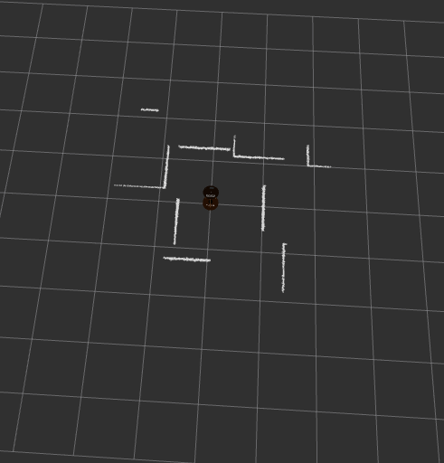
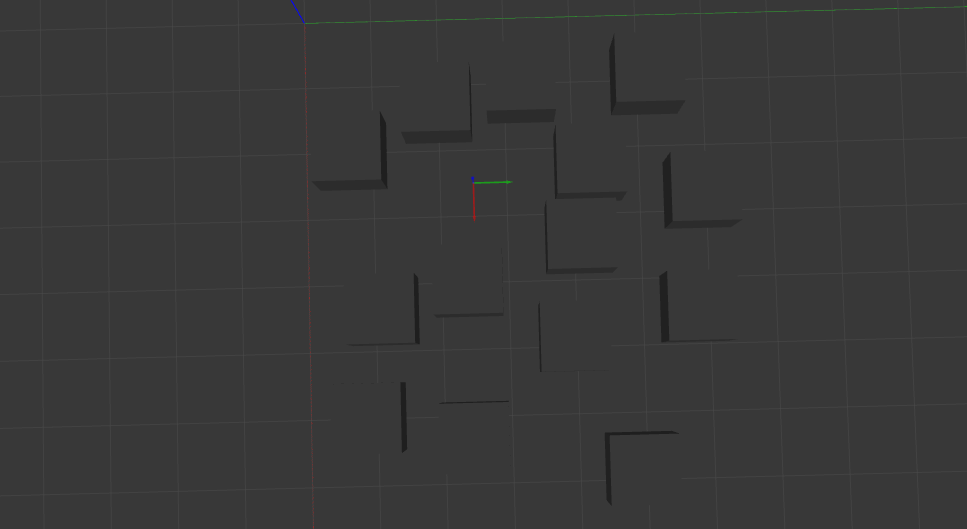

# Betabot Obstacle avoider

- [Betabot Obstacle avoider](#betabot-obstacle-avoider)
  - [Project Description](#project-description)
  - [After you implement the pkg state your reflection below](#after-you-implement-the-pkg-state-your-reflection-below)
    - [How did you plan the task?](#how-did-you-plan-the-task)
    - [what is your logic?](#what-is-your-logic)
    - [What ROS REPs did you used?](#what-ros-reps-did-you-used)
    - [How we could increase the overall performance?](#how-we-could-increase-the-overall-performance)
    - [List the most time consuming problems you faced](#list-the-most-time-consuming-problems-you-faced)
    - [Demo](#demo)
    - [Screencwcwshot](#screenshot)
      - [NAME:](#name) Moustafa Elsayed
      - [ID:](#id) 201600848

## Project Description 

Create a ROS package with custom nodes c++/python to move the
betabot randomly in gazebo, the movement should be triggered then the robot
moves randomly while avoid objects based on laser scans reading based on the laser
scans.

>NOTE: DON'T process one ray of the laser scans array or it will be considered ultrasonic/IR sensor.try to come up with approach thats use the laser full potential. 

>To make you project standout try not to visit any place twice.

---

## After you implement the pkg state your reflection below

### How did you plan the task?

1. First I knew how to get scan data
2. I noticed that the laser device is not in the right orientation so I fixed this issue
3. I implemented the logic of moving

### what is your logic?

- The logic was simple, I took 5 readings, front, right, left, front right, and front left
  - I checked if there is an obstacle right in front of me or not
    - If no, then checked which of my front right or front left had more space, and depending on the reading I will turn a little towards the free space.
    - If yes, then look around, and find the most free space and turn towards it
    - move forward
    - repeat the process

### What ROS REPs did you used?

### How we could increase the overall performance?

- I believe if we made more complex code that not only takes 5 distances, but for example, 20 distances, this will make the bot reacts much better for narrower places

### List the most time consuming problems you faced

- None, it was an easy one

---

### Demo
Add unlisted youtube/drive video

[Demo](https://youtu.be/VvhDbN5myTk)

### Screenshot

---

#### NAME: Moustafa Elsayed
#### ID: 201600848

---
